# MealPlanner

## Overview
MealPlanner is a comprehensive solution designed to help users plan their meals and manage their nutritional intake effectively. It consists of two main components:
- **Backend**: Built with Node.js, Express, and MongoDB.
- **Frontend**: Built with React and Bootstrap.

## Features
- User authentication and authorization
- Meal planning and scheduling
- Nutritional information tracking
- User-friendly interface with dark mode support

## Prerequisites
- Node.js (version 14.x or higher)
- npm (version 6.x or higher)
- MongoDB (version 4.x or higher)

## Installation

### Backend
1. Clone the repository:
    ```sh
    git clone https://github.com/aman13nagar/mealplanner.git
    cd mealplanner/backend
    ```

2. Install backend dependencies:
    ```sh
    npm install
    ```

3. Create a `.env` file in the backend directory and add your environment variables:
    ```env
    MONGODB_URI=your-mongodb-uri
    JWT_SECRET=your-jwt-secret
    ```

4. Start the backend server:
    ```sh
    npm start
    ```

### Frontend
1. Navigate to the frontend directory:
    ```sh
    cd ../frontend
    ```

2. Install frontend dependencies:
    ```sh
    npm install
    ```

3. Start the frontend development server:
    ```sh
    npm start
    ```

## Usage
1. Register an account or log in if you already have one.
2. Start planning your meals by adding them to your schedule.
3. Track your nutritional intake through the user-friendly dashboard.

## API Endpoints
- **POST** `/api/auth/register`: Register an account.
- **POST** `/api/auth/login`: Log in if you already have an account
- **GET** `/api/auth/loadUser`: Get a User. 
- **GET** `/api/meal-plans/`: Retrieve meal plans
- **POST** `/api/meal-plans/`: Create a meal plan.
- **PUT** `/api/meal-plans/`: Update a meal plan.
- **DELETE** `/api/meal-plans/`: Delete a meal plan.
- **GET** `/api/meal-plans/daily-meals/`: Get daily meals.
- **POST** `/api/meal-plans/daily-meals/`: Create your daily meal plan.
- **PUT** `/api/meal-plans/daily-meals/:id`: Update your daily meal plan for a specific date.
- **POST** `/api/meal-plans/nutrition-info/`: Get nutrition information for your created Meal plan.
- **GET** `/api/meal-plans/generate/`: Generate a meal plan.
- **GET** `/api/meal-plans/weekly/`: Get weekly meal plans.
- **POST** `/api/password/forgot-password/`: Get a email for reseting your password.
- **POST** `/api/password/reset-password/`: Reset your password via the link sent to your email.
- **GET** `/api/recipe/`: Get a recipe.
- **GET** `/api/recipe/:id`: Get a recipe by Id.
- **POST** `/api/recipe/:id`: Add a recipe.
- **GET** `/api/recipes/`: Get all recipes.
- **POST** `/api/recipes/`: Create a recipe.
- **PUT** `/api/recipes/`: Update a recipe.
- **DELETE** `/api/recipes/`: Delete a recipe.
- **POST** `/api/nutritions/:recipeId/`: Save nutrition data for a recipe.
- **GET** `/api/nutritions/:recipeId/`: Get nutrition data for a recipe.
- **POST** `/api/hydration/`: Add amount of water.
- **GET** `/api/hydration/:userId/`: Get hydration information for a user by userid.
- **DELETE** `/api/hydration/:id/`: Delete hydration information by id.
- **POST** `/api/weight/`: Add your weight.
- **GET** `/api/weight/:userId/`: Get weightData for a user by userid.
- **DELETE** `/api/weight/:id/`: Delete weightData by id.
- **POST** `/api/exercise/`: Add exercise information.
- **GET** `/api/exercise/:userId/`: Get exercise information for a user by userid.
- **DELETE** `/api/exercise/:id/`: Delete exercise information by id.

## Screenshots
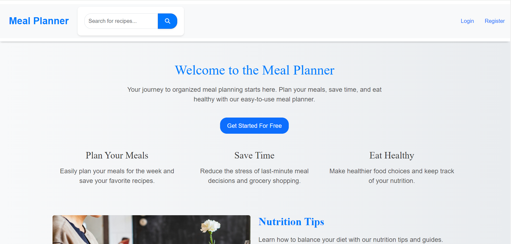
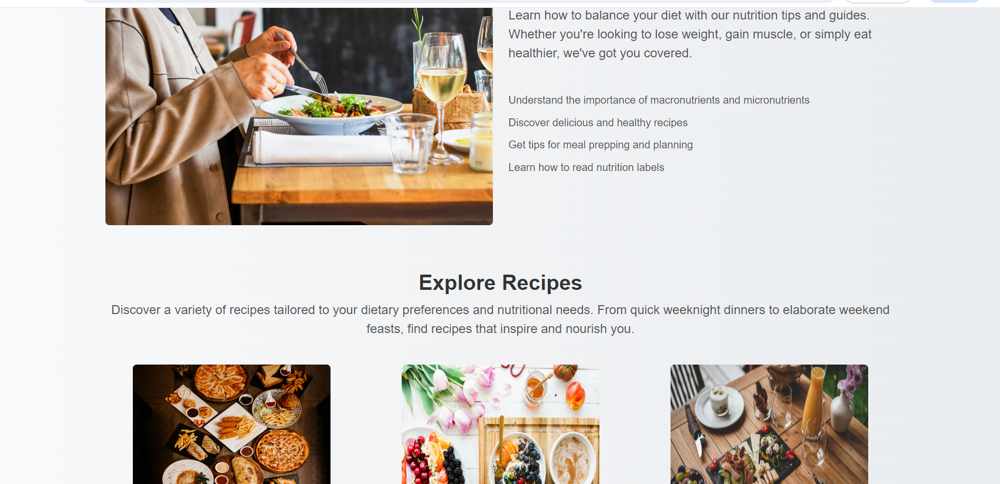
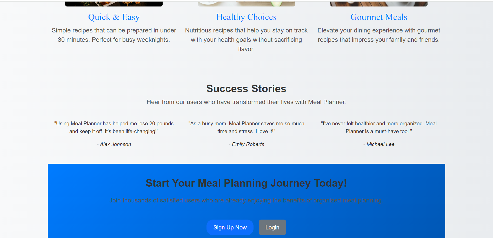
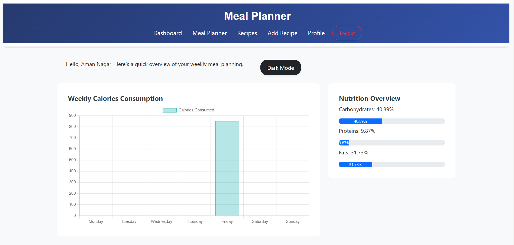
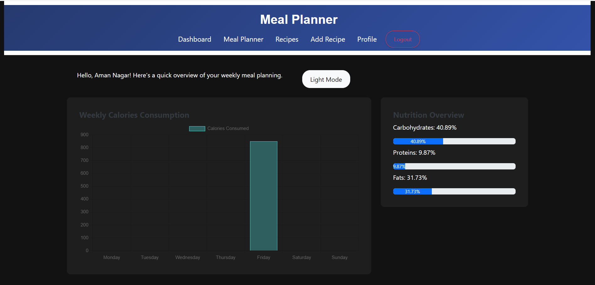
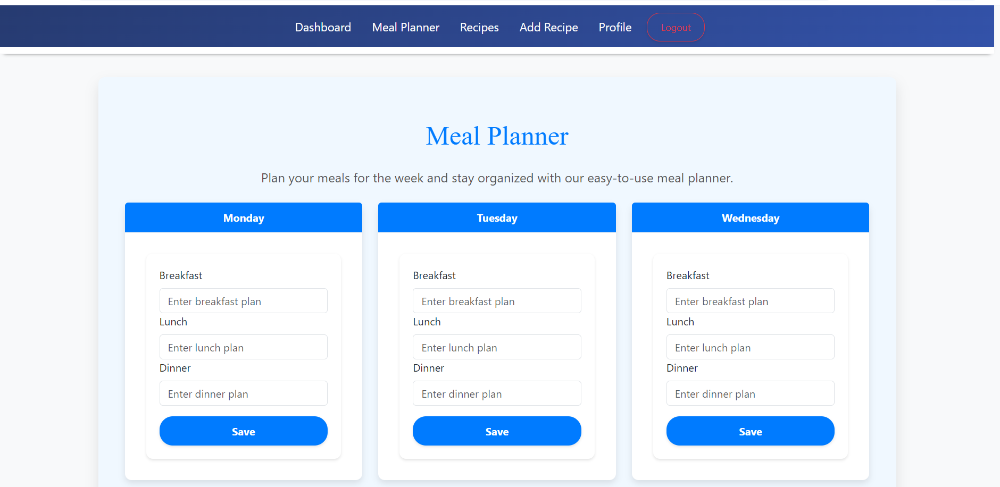
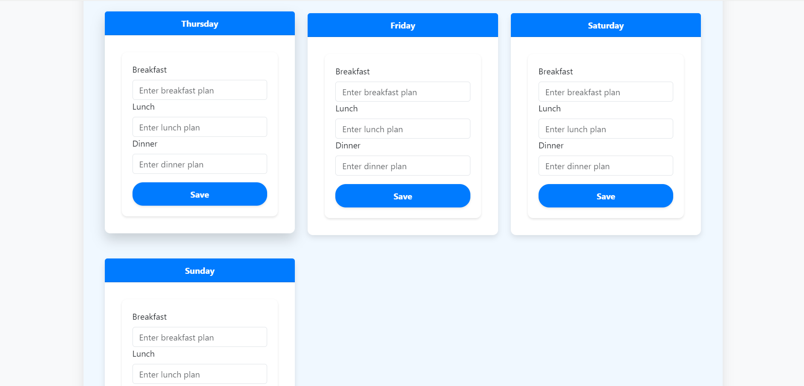
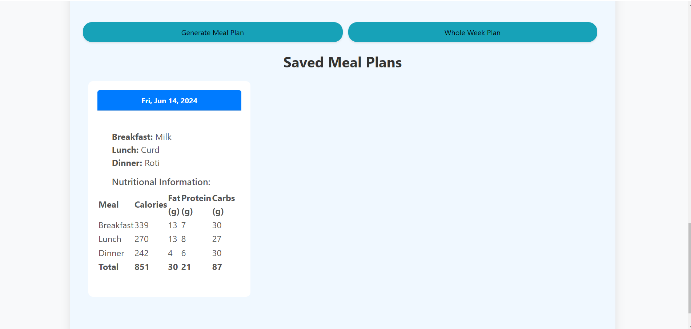
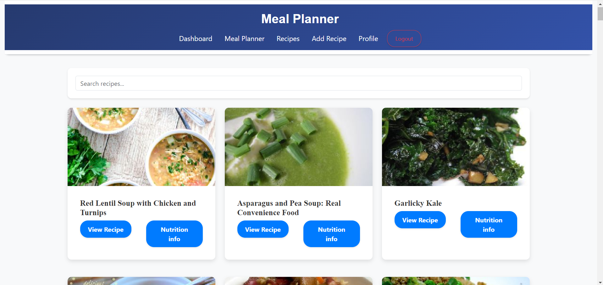
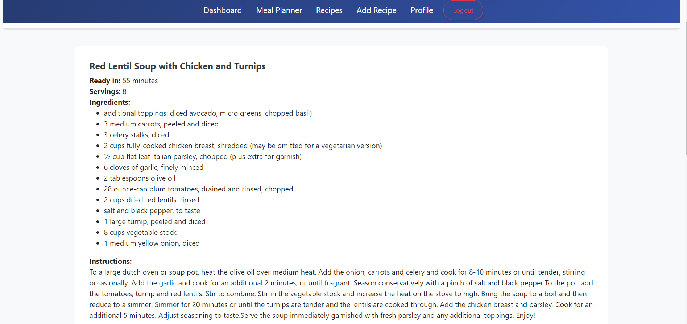
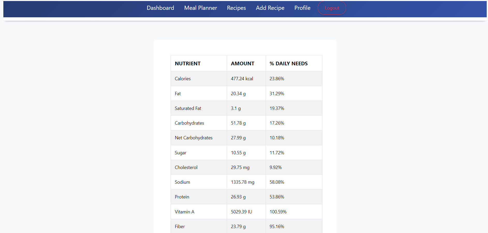
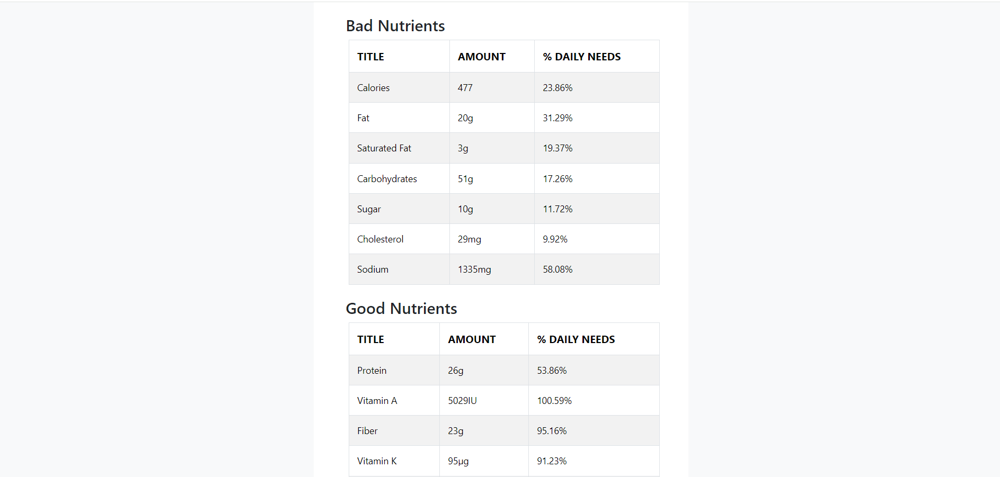
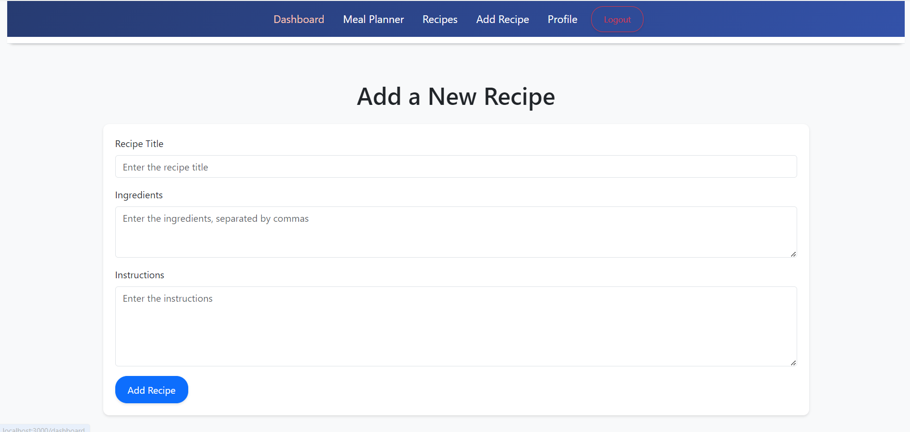
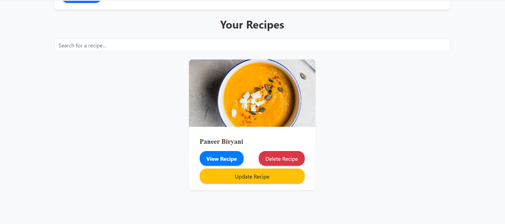
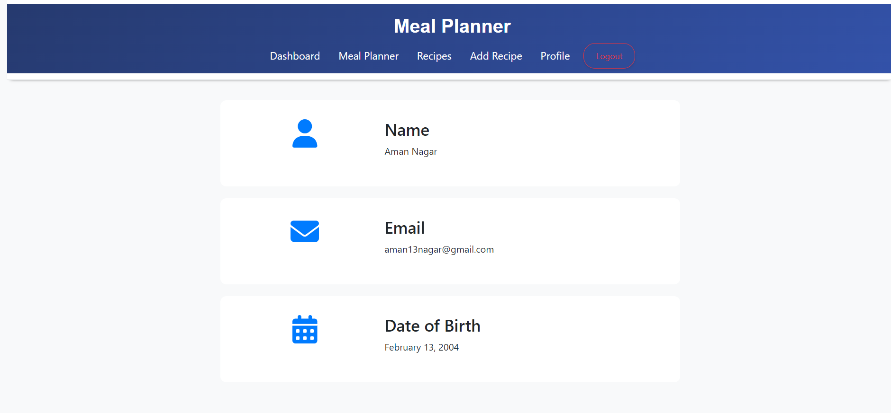

## Contributing
If you would like to contribute, please fork the repository and use a feature branch. Pull requests are welcome.

1. Fork the repository
2. Create a feature branch (`git checkout -b feature-branch`)
3. Commit your changes (`git commit -am 'Add some feature'`)
4. Push to the branch (`git push origin feature-branch`)
5. Create a new Pull Request

## Contact
- **Name**: aman13nagar
- **Email**: aman13nagar@gmail.com

Developed by [Aman Nagar], a fourth-year Computer Science student at NIT Rourkela.
